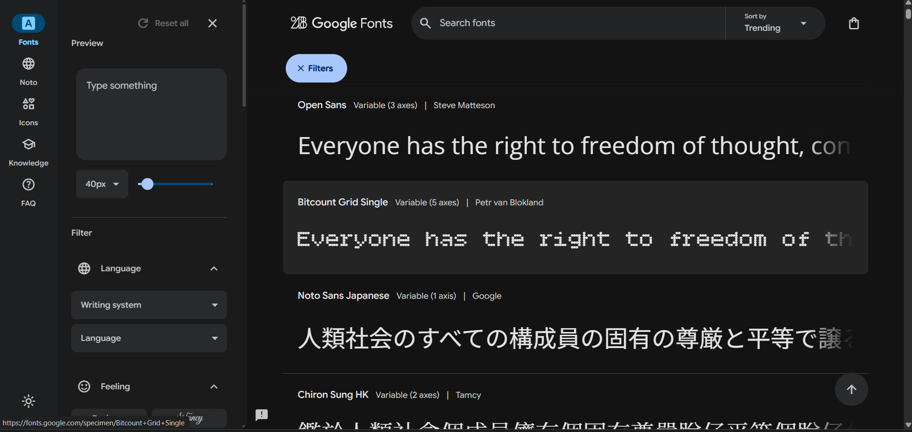
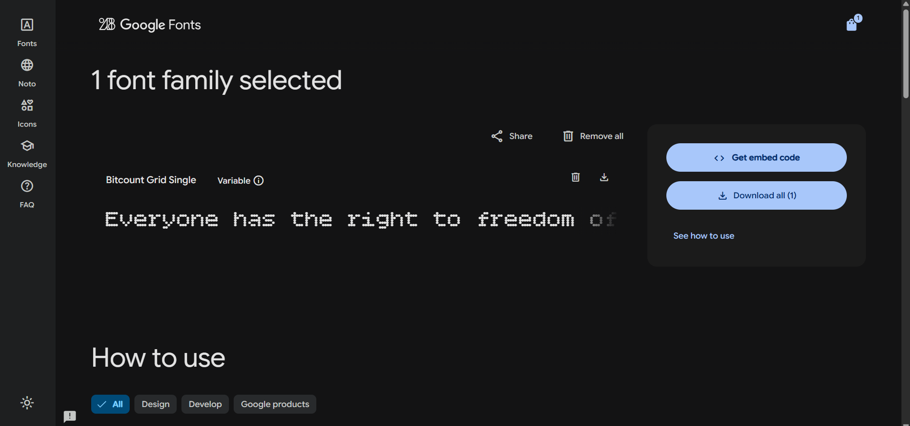

# How to Add a Custom Web Font (Example with Google Fonts)

This guide shows how to integrate a custom web font into a project using HTML and CSS. Google Fonts is used here for demonstration, but the same approach applies to any provider or locally hosted fonts.

------------------------------------------------------------

## 1. Select a Font (Example: Google Fonts)

Go to https://fonts.google.com/ and pick the typeface you want to use.

Browse and select the font you want to use.

For the demo: Bitcount Grid Single


------------------------------------------------------------

## 2. Choose Styles (weights, italic, etc.)

On the font page:
- Select the weights (100-900)
- Enable italic if needed
- Adjust variable axes when available

Then click "Get embed code" or the <> button.




------------------------------------------------------------

## 3. Add the <link> Tag in the <head> of Your HTML

Copy the snippet provided by Google Fonts and paste it inside the <head> section of your HTML file.

Example:

```html
<link rel="preconnect" href="https://fonts.googleapis.com">
<link rel="preconnect" href="https://fonts.gstatic.com" crossorigin>
<link href="https://fonts.googleapis.com/css2?family=Bitcount+Grid+Single:wght@100..900&display=swap" rel="stylesheet">
```




------------------------------------------------------------

## 4. Apply the Font in CSS

Use the font-family property in your stylesheets.

Example:

```css
body {
  font-family: "Bitcount Grid Single", sans-serif;
  font-weight: 400;
}
```

You can also apply different weights:

```css
h1 {
  font-family: "Bitcount Grid Single", sans-serif;
  font-weight: 900;
}

p {
  font-family: "Bitcount Grid Single", sans-serif;
  font-weight: 200;
}
```

------------------------------------------------------------

## Additional Notes

| Recommendation | Reason |
|---------------|--------|
| Always provide a fallback like `sans-serif` | Ensures text remains readable if the font fails to load |
| Only selected weights are available | Unselected styles will not render correctly |
| Keep fonts minimal | Reduces loading time and improves performance |
| `display=swap` recommended | Prevents invisible text while fonts load |

------------------------------------------------------------


