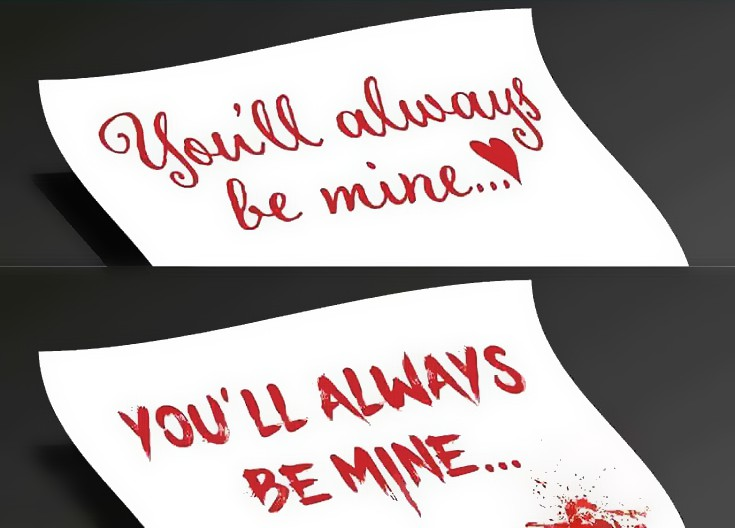

# Typography

## What is typography?

Typography refers to the **style, arrangement, and appearance of text**.
In web design, typography plays a critical role in **readability, usability, and visual hierarchy**.

Good typography helps users:
- understand content faster
- scan information easily
- perceive tone and intent correctly

Poor typography can make even well-designed layouts hard to use.

## What is typography?

Typography refers to the **style, arrangement, and appearance of text**.
In web design, typography plays a critical role in **readability, usability, and visual hierarchy**.

Good typography helps users:
- understand content faster
- scan information easily
- perceive tone and intent correctly

Poor typography can make even well-designed layouts hard to use.

## Why typography matters

Typography is not only about choosing a font.
It directly affects how information is **perceived and interpreted**.

For example:
- A dashboard with poor typography can feel confusing or unprofessional
- The same interface, with good typography, can feel clear and trustworthy

Typography supports the message  it should never compete with it.

Here's an example

---

## General Rules

Some simple rules greatly improve typographic quality:

- Use **no more than two font families** in a project
- Ensure sufficient **contrast** between text and background
- Maintain consistent font usage across the interface
- Match the typography style to the **context and message**

Breaking these rules is possible, but only with clear intent.

**Il est important de ne pas dépasser plus de 2 polices de caractères**

## Common Font Families

Typography can be grouped into major font families.
Each family conveys a different **tone, personality, and intent**, making it suitable for specific types of projects.

Understanding these families helps you choose the right font **based on theme and context**, not personal taste alone.

---

### Serif Fonts

Serif fonts feature small decorative strokes at the ends of letters.

**General characteristics**
- Serious and authoritative
- Traditional and formal
- Perceived as stable and trustworthy
- Often associated with heritage and respect

**Common use cases**
- Legal documents and law firms
- Editorial content (magazines, newspapers)
- Architecture, culture, and academic contexts
- Luxury or high-credibility brands

**Main serif subcategories**
- **Old Style** — warm, human, classic (e.g. Garamond)
- **Transitional** — balanced and refined (e.g. Baskerville)
- **Modern (Didone)** — high contrast, elegant, formal (e.g. Didot)
- **Slab Serif** — bold, strong, industrial (e.g. Rockwell)

---

### Sans-Serif Fonts

Sans-serif fonts do not include decorative strokes.

**General characteristics**
- Clean and modern
- Approachable and friendly
- Highly readable on screens
- Direct and functional

**Common use cases**
- User interfaces and applications
- Startups and tech companies
- Dashboards and digital products
- Contemporary branding

**Main sans-serif subcategories**
- **Grotesque** — neutral and utilitarian
- **Neo-Grotesque** — refined and balanced (e.g. Helvetica)
- **Humanist** — more organic and readable (e.g. Open Sans)
- **Geometric** — precise and modern (e.g. Futura)

---

### Script Fonts

Script fonts mimic handwriting or calligraphy.

**General characteristics**
- Personal and expressive
- Creative and artistic
- Emotional and informal

**Common use cases**
- Logos
- Invitations
- Branding accents
- Decorative highlights

> Script fonts should be used sparingly.  
> They are **not suitable for long body text** due to readability issues.

### Display Fonts

Display fonts are designed to stand out visually.

**General characteristics**
- Bold and expressive
- Eye-catching and distinctive
- Often experimental or playful

**Common use cases**
- Headlines and titles
- Posters and banners
- Logos and branding statements

> Display fonts are meant for **short text only**.  
> Using them in paragraphs reduces readability and professionalism.

## Key Takeaway

Font families are not just stylistic choices.
They communicate meaning before the user reads a single word.

Choosing the right family depends on:
- the message
- the audience
- the context
- the medium (print vs screen)

## Contrast in Typography

Contrast helps guide the reader’s eye.

Contrast can be created using:
- font size
- font weight
- font family
- spacing

Good contrast improves clarity and structure.
Poor contrast makes content difficult to scan.

---

## Typography and Context

Typography should adapt to its context:

- A car dashboard UI requires clarity and fast readability
- A portfolio site allows for more expressive typography
- Informational websites prioritize comfort and legibility

Choosing the right typography means understanding **where and how** it will be read.
